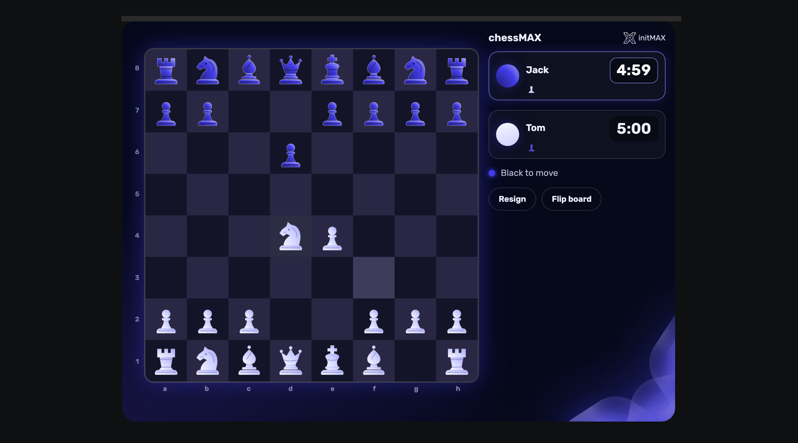
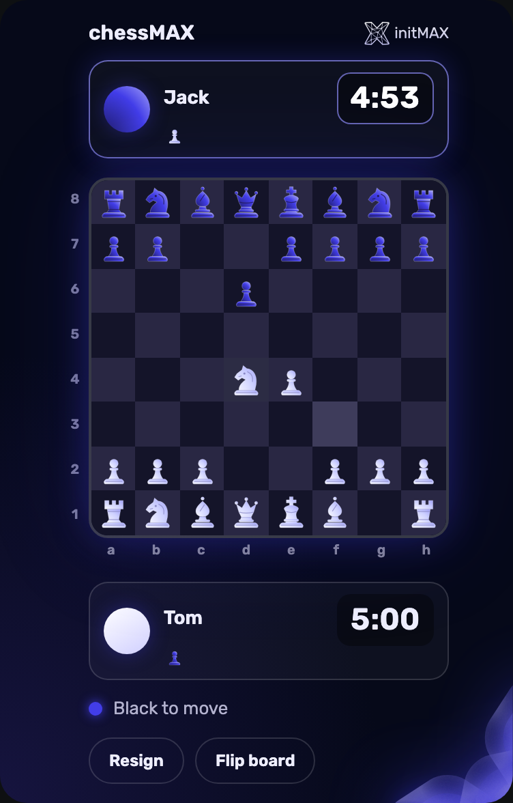
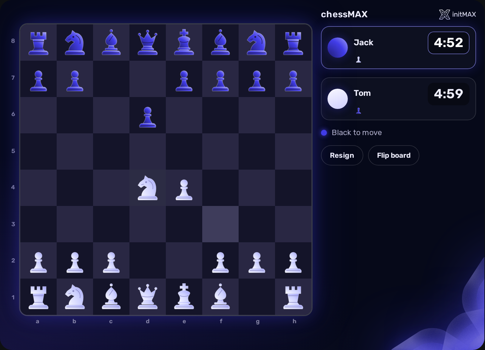
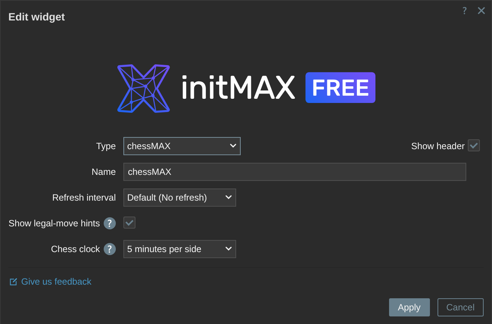
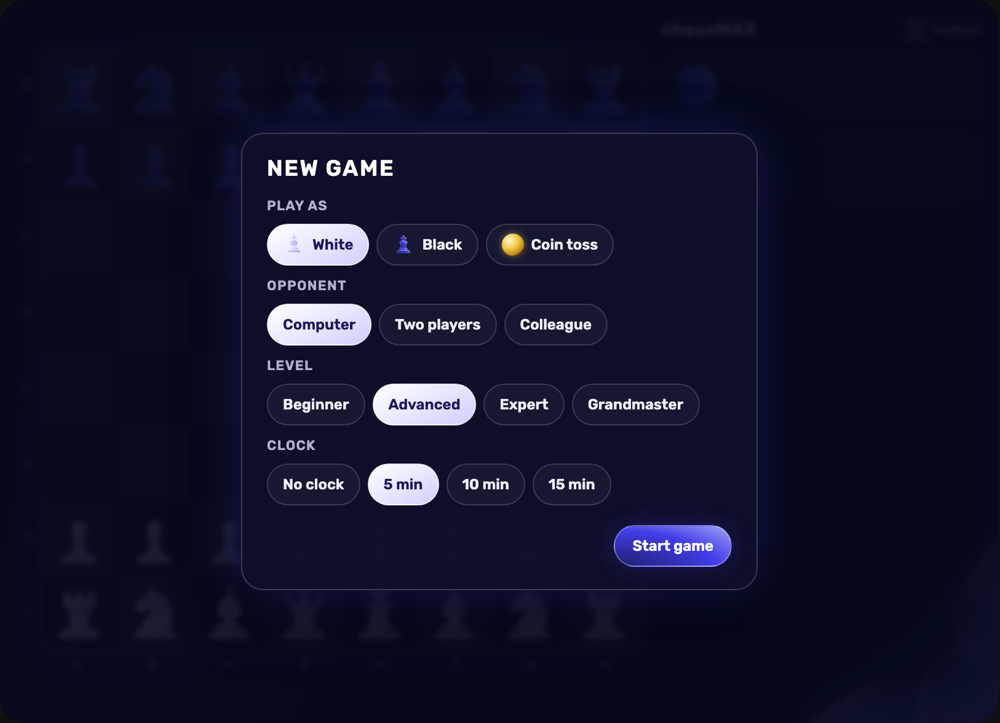

<h1>chessMAX</h1>

developed and maintained by

and community

<strong>Play chess right on your Zabbix dashboard.</strong> 
Challenge Stockfish, invite a colleague or share one screen - with clear SVG pieces, legal-move hints and an optional chess clock.

<a href="#what-you-can-build"><strong>Features</strong></a> &nbsp;·&nbsp;
<a href="#examples"><strong>Examples</strong></a> &nbsp;·&nbsp;
<a href="#install"><strong>Install</strong></a> &nbsp;·&nbsp;
<a href="#free-vs-pro"><strong>FREE vs PRO</strong></a> &nbsp;·&nbsp;
<a href="https://portal.initmax.com/catalog/zabbix-chessmax"><strong>Portal</strong></a> &nbsp;·&nbsp;
<a href="#configuration"><strong>Docs</strong></a>

 

---

## Why chessMAX

Take a chess break without leaving your dashboard. **chessMAX** keeps your current game when you reload or sign in again, and synchronises it between your widgets. Stockfish runs inside your browser; moves are checked and saved by the Zabbix frontend. Fonts, icons, scripts and the chess engine are bundled locally: gameplay needs no external CDN, font service or chess API.

## What you can build

<table>
<tr><td width="50%" valign="top"><b>A game against Stockfish</b> Choose Beginner, Advanced, Expert or Grandmaster. The bundled engine needs no external chess service.</td><td width="50%" valign="top"><b>A match with a colleague</b> A Super admin can invite any enabled Zabbix user, who accepts or declines from their own chessMAX widget.</td></tr>
<tr><td valign="top"><b>Two players at one screen</b> Take turns on the same board. Name the second player and flip the board when useful.</td><td valign="top"><b>A timed challenge</b> Give each side 5, 10 or 15 minutes, or play without a clock.</td></tr>
<tr><td valign="top"><b>A board for learning</b> Hover or select a piece to see its legal destinations. Captures, check and material advantage are shown alongside the board.</td><td valign="top"><b>A game across dashboards</b> Your current game follows your Zabbix account, including other tabs and dashboard widgets.</td></tr>
</table>

## Examples

<table>
<tr>
<td width="32%" align="center" valign="top"> <small><b>Portrait layout</b> - player cards above and below the board</small></td>
<td width="68%" align="center" valign="top"> <small><b>Landscape layout</b> - board and player cards side by side</small></td>
</tr>
</table>

## Configuration

The widget form has two settings: **Show legal-move hints** and the default **Chess clock**. In the new-game dialog, choose your colour (or toss a coin), opponent, difficulty and clock. Changes to these choices apply to the new game. There are no paid controls to unlock.

<table>
<tr>
<td width="50%" align="center" valign="top"> <small><b>Widget settings</b> - hints and default clock</small></td>
<td width="50%" align="center" valign="top"> <small><b>New game</b> - choose how to play</small></td>
</tr>
</table>

Click a piece and its destination, or drag it. For castling, move the king to its destination or onto its rook. Use the promotion chooser when a pawn reaches the last rank. Keyboard users can focus the widget, move with arrow keys and select with Enter or Space; dialog controls keep their normal keyboard behaviour.

Each account has one current game. Only a Super admin can send an invitation; the recipient may be a regular Zabbix user. Declining the invitation notifies its sender. The other player must open a chessMAX widget to receive the invitation; active boards normally synchronise every three seconds.

Checkmate, stalemate and insufficient material are detected. Repetition and the 50-move rule are automatically treated as draws; this is a casual-play convention rather than a tournament claim procedure. A timeout is a draw when the opponent lacks mating material. This material check does not solve arbitrary blocked positions or fortresses. Games have a safety limit of 600 plies (300 full moves). Resigning or leaving an active game ends it.

## Install

chessMAX is distributed as GPG-signed deb and rpm packages, with source archives also available.

**Easiest way - the guided installer on the Portal:**

[Open the chessMAX guided installer](https://portal.initmax.com/catalog/zabbix-chessmax#how-to-install)

The deb/rpm installer registers and enables a new chessMAX installation automatically, while preserving an existing administrator-disabled state. Add chessMAX to a dashboard after installation. Install the package on every Zabbix frontend node.

For a manual ZIP installation, follow the archive's **INSTALL.md**, select the payload for your Zabbix version, scan the module directory in **Administration > General > Modules**, and enable chessMAX. The Modules page location varies by Zabbix version. Package installations switch payloads automatically when Zabbix changes; ZIP installations require following the archive instructions again after a frontend upgrade or rollback.

## FREE vs PRO

chessMAX is entirely FREE. There is no PRO edition or paid feature set.

| Feature | FREE |
|---|:---:|
| Localised into all 27 Zabbix display languages | ✅ |
| High availability ready | ✅ |
| Play against the built-in engine (4 levels) | ✅ |
| Play a colleague on another dashboard | ✅ |
| Two players at one screen | ✅ |
| Chess clock | ✅ |
| Legal-move hints | ✅ |
| Licence | [AGPLv3](./LICENSE.md) |

## Requirements

| Requirement | Details |
|---|---|
| Zabbix | 6.0, 6.2, 6.4, 7.0, 7.2 and 7.4; one package includes both frontend module generations |
| PHP | 7.4 or newer, within the requirements of your Zabbix version |
| Browser | A modern browser with JavaScript; WebAssembly and Web Workers for Stockfish |
| Operating system | A supported Zabbix frontend installation on a deb- or rpm-based distribution |
| Editions | FREE only |
| Languages | 27 catalogues: 25 current display languages plus Dutch and Romanian for older Zabbix versions; the widget follows each user's language setting |
| High availability | Ready. Game records are stored in the shared Zabbix database. Install chessMAX on every frontend node. |

## Support & links

- [initMAX Portal](https://portal.initmax.com/catalog/zabbix-chessmax) - packages and guided installation
- [chessMAX documentation](https://www.initmax.com/wiki/chessmax/) - installation, configuration and examples
- [chessMAX product page](https://www.initmax.com/product/chessmax/) - features and FREE download
- Source code (FREE, AGPLv3) - included in every package and published as a [source archive](https://repo.initmax.com/zabbix/free/zip/chessmax/) on repo.initmax.com
- [Stockfish](https://stockfishchess.org/) - the bundled GPLv3 chess engine; dependency versions and checksums are in [VENDOR.md](./.readme/vendor.md)
- Support: [info@initmax.com](mailto:info@initmax.com)

---

FREE: [AGPLv3](https://www.gnu.org/licenses/agpl-3.0.html) · (c) 2021-2026 initMAX s.r.o.
